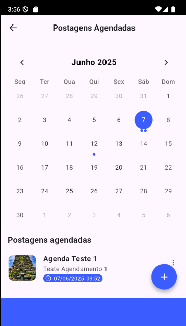

# 📅 Agendamento de Postagens no Instagram

Aplicativo Flutter que permite agendar postagens localmente com título, descrição, data e hora. Ideal para organizar publicações futuras sem depender de conexão externa com redes sociais. As postagens são armazenadas no dispositivo e exibidas em um calendário interativo, facilitando a visualização e o controle do conteúdo agendado.

---

## 🎯 Objetivo

Permitir que o usuário agende uma postagem contendo a descrição e fotos a ser publicado.

---

## ✅ Funcionalidades implementadas

- [x] Tela de agendamento com título, descrição, data e hora
- [x] Botão de "Agendar"
- [x] Lista de postagens agendadas para a data selecionada
- [x] Exibição de indicadores visuais no calendário (bolinhas abaixo dos dias com postagens agendadas)
- [x] Persistência local com `SharedPreferences`
- [x] Suporte à edição e exclusão de postagens
- [x] Uso de `setState` para gerenciamento de estado
- [x] Organização modular dos arquivos

---

## 🖼️ Pré-visualização

### Tela de Agendamento


### Calendário com Postagens



### Confirmação de Agendamento


---

## 🗂 Estrutura do projeto

```bash
lib/
├── data/
│   └── local/
│       └── post_storage.dart
│
├── features/
│   ├── home/
│   │   └── presentation/
│   │       └── home_screen.dart
│   │
│   ├── scheduling/
│   │   └── presentation/
│   │       └── scheduling_screen.dart
│
├── main.dart

```
